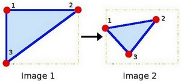

# affineTransformation

- 使用OpenCV函数 [warpAffine](http://opencv.willowgarage.com/documentation/cpp/imgproc_geometric_image_transformations.html?#cv-warpaffine) 来实现一些简单的重映射.

- 使用OpenCV函数 [getRotationMatrix2D](http://opencv.willowgarage.com/documentation/cpp/imgproc_geometric_image_transformations.html?#cv-getrotationmatrix2d) 来获得一个  旋转矩阵


## 原理 

### 仿射变换

1. 一个任意的仿射变换都能表示为 *乘以一个矩阵* (线性变换) 接着再 *加上一个向量* (平移).

2. 综上所述, 我们能够用仿射变换来表示:

   1. 旋转 (线性变换)
   2. 平移 (向量加)
   3. 缩放操作 (线性变换)

   你现在可以知道, 事实上, 仿射变换代表的是两幅图之间的 **关系** .

3. 我们通常使用  矩阵来表示仿射变换.

   <div align=center>
     
   </div>

   考虑到我们要使用矩阵  和  对二维向量  做变换, 所以也能表示为下列形式:

     or  ![T = M \cdot  [x, y, 1]^{T}](./pic/f44f98e19b4ee0613633b70414a47259846b2d27.png)


   <div align=center>
     
   </div>


### 仿射变换如何得到

1. 好问题. 我们在上文有提到过仿射变换基本表示的就是两幅图片之间的 **联系** . 关于这种联系的信息大致可从以下两种场景获得:

   1. 我们已知  和 T 而且我们知道他们是有联系的. 接下来我们的工作就是求出矩阵 
   2. 我们已知  and . 要想求得 . 我们只要应用算式  即可. 对于这种联系的信息可以用矩阵  清晰的表达 (即给出明确的2×3矩阵) 或者也可以用两幅图片点之间几何关系来表达.

2. 让我们形象地说明一下. 因为矩阵  联系着两幅图片, 我们以其表示两图中各三点直接的联系为例. 见下图:

   <div align=center>
     
   </div>

   点1, 2 和 3 (在图一中形成一个三角形) 与图二中三个点一一映射, 仍然形成三角形, 但形状已经大大改变. 如果我们能通过这样两组三点求出仿射变换 (你能选择自己喜欢的点), 接下来我们就能把仿射变换应用到图像中所有的点.


## 代码解释

1. 定义一些需要用到的变量, 比如需要用来储存中间和目标图像的Mat和两个需要用来定义仿射变换的二维点数组.

   ```C++
   Point2f srcTri[3];
   Point2f dstTri[3];
   
   Mat rot_mat( 2, 3, CV_32FC1 );
   Mat warp_mat( 2, 3, CV_32FC1 );
   Mat src, warp_dst, warp_rotate_dst;
   ```

2. 加载源图像:

   ```C++
   src = imread( "cat.jpg", 1 );
   ```

3. 以与源图像同样的类型和大小来对目标图像初始化:

   ```C++
   warp_dst = Mat::zeros( src.rows, src.cols, src.type() );
   ```

4. **仿射变换:** 正如上文所说, 我们需要源图像和目标图像上分别一一映射的三个点来定义仿射变换:

   ```C++
   srcTri[0] = Point2f( 0,0 );
   srcTri[1] = Point2f( src.cols - 1, 0 );
   srcTri[2] = Point2f( 0, src.rows - 1 );
   
   dstTri[0] = Point2f( src.cols*0.0, src.rows*0.33 );
   dstTri[1] = Point2f( src.cols*0.85, src.rows*0.25 );
   dstTri[2] = Point2f( src.cols*0.15, src.rows*0.7 );
   ```

   你可能想把这些点绘出来以获得对变换的更直观感受. 他们的位置大概就是在上面图例中的点的位置 (原理部分). 你会注意到由三点定义的三角形的大小和方向改变了.

5. 通过这两组点, 我们能够使用OpenCV函数 [getAffineTransform](http://opencv.willowgarage.com/documentation/cpp/imgproc_geometric_image_transformations.html?#cv-getaffinetransform) 来求出仿射变换:

   ```C++
   warp_mat = getAffineTransform( srcTri, dstTri );
   ```

   我们获得了用以描述仿射变换的  矩阵 (在这里是 **warp_mat**)

6. 将刚刚求得的仿射变换应用到源图像

   ```C++
   warpAffine( src, warp_dst, warp_mat, warp_dst.size() );
   ```

   函数有以下参数:

   - **src**: 输入源图像
   - **warp_dst**: 输出图像
   - **warp_mat**: 仿射变换矩阵
   - **warp_dst.size()**: 输出图像的尺寸

   这样我们就获得了变换后的图像! 我们将会把它显示出来. 在此之前, 我们还想要旋转它...

7. **旋转:** 想要旋转一幅图像, 你需要两个参数:

   1. 旋转图像所要围绕的中心
   2. 旋转的角度. 在OpenCV中正角度是逆时针的
   3. *可选择:* 缩放因子

   我们通过下面的代码来定义这些参数:

   ```C++
   Point center = Point( warp_dst.cols/2, warp_dst.rows/2 );
   double angle = -50.0;
   double scale = 0.6;
   ```

8. 我们利用OpenCV函数 [getRotationMatrix2D](http://opencv.willowgarage.com/documentation/cpp/imgproc_geometric_image_transformations.html?#cv-getrotationmatrix2d) 来获得旋转矩阵, 这个函数返回一个  矩阵 (这里是 *rot_mat*)

   ```C++
   rot_mat = getRotationMatrix2D( center, angle, scale );
   ```

9. 现在把旋转应用到仿射变换的输出.

   ```C++
   warpAffine( warp_dst, warp_rotate_dst, rot_mat, warp_dst.size() );
   ```

10. 最后我们把仿射变换和旋转的结果绘制在窗体中，源图像也绘制出来以作参照:

    ```C++
    namedWindow( source_window, CV_WINDOW_AUTOSIZE );
    imshow( source_window, src );
    
    namedWindow( warp_window, CV_WINDOW_AUTOSIZE );
    imshow( warp_window, warp_dst );
    
    namedWindow( warp_rotate_window, CV_WINDOW_AUTOSIZE );
    imshow( warp_rotate_window, warp_rotate_dst );
    ```


